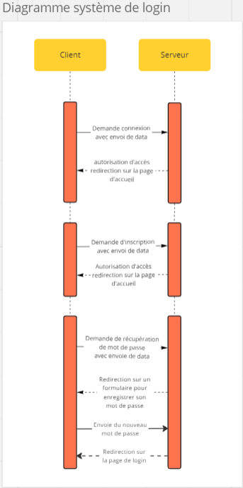
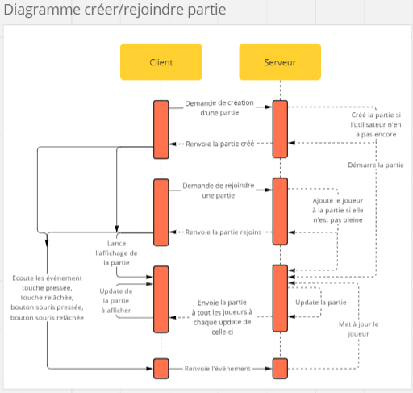
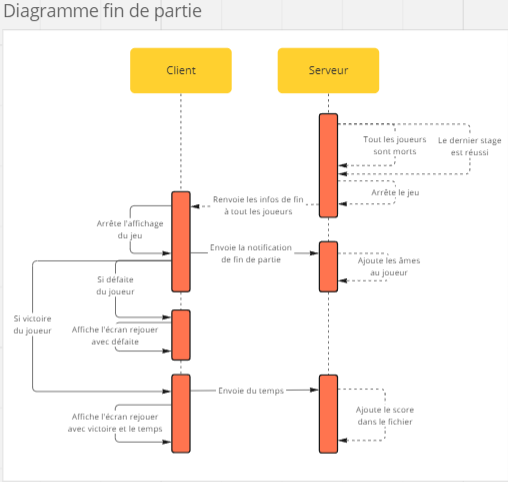

# Rapport sae-2024-groupeG-Kiecken-Desmee-Gaienier

## Auteurs

- KIECKEN Raphael
- DESMEE Nathan
- GAIENIER Antoine

## Diagrammes de séquence

  
  

## Difficultés techniques

La principale difficulté que nous avons rencontrée a eu lieu lors de la migration du jeu du côté client vers le côté serveur et de garantir que toutes les fonctionnalités du jeu restent opérationnelles. Cette transition implique un déplacement progressif de toutes les fonctionnalités du jeu du côté client vers le côté serveur, ce qui a pu potentiellement perturber le fonctionnement du jeu .
Pour surmonter cette difficulté, nous avons adopté une approche itérative. Plutôt que de déplacer l'intégralité du jeu côté serveur en une seule fois, nous avons procédé morceau par morceau. Cela nous a permis de vérifier régulièrement que le jeu fonctionnait toujours après chaque étape de migration.

La seconde difficulté que nous avons rencontrée était d'empêcher 'un utilisateur de se connecter plusieurs fois simultanément au jeu. Cette situation pouvait poser des problèmes de cohérence dans les données.
Pour résoudre ce problème nous avons décidé de rajouter un paramètre connexion, qui passe “true” à la connexion et “false” à la déconnexion ce qui implique de bien déconnecter l’utilisateur quand il se déconnecte de lui-même, quand il ferme la page, quand le serveur plante pour ne pas bloquer l'accès à son compte.

## Points d'amélioration/d'achèvement

Les point du projet que nous aurions pu amélioration sont:

- La sécurité des données
- L'équilibrage du jeu

Pour réellement achever Heaven Must Fall il faudrait :

- une version compatible sur mobile
- Plus de personnalisation
- Une plus grande variété de MOB
- Plus de niveaux

## Notre fièreté

Nous sommes particulièrement fiers de notre travail d'équipe, nous avons su construire un environnement collaboratif où chacun apporte ses compétences et ses idées. Nous avons développé une culture d'entraide et de soutien mutuel, ce qui nous a permis de surmonter les défis techniques avec succès. Chaque membre de l'équipe a pu contribuer à l'amélioration continue de Heaven Must Fall.
